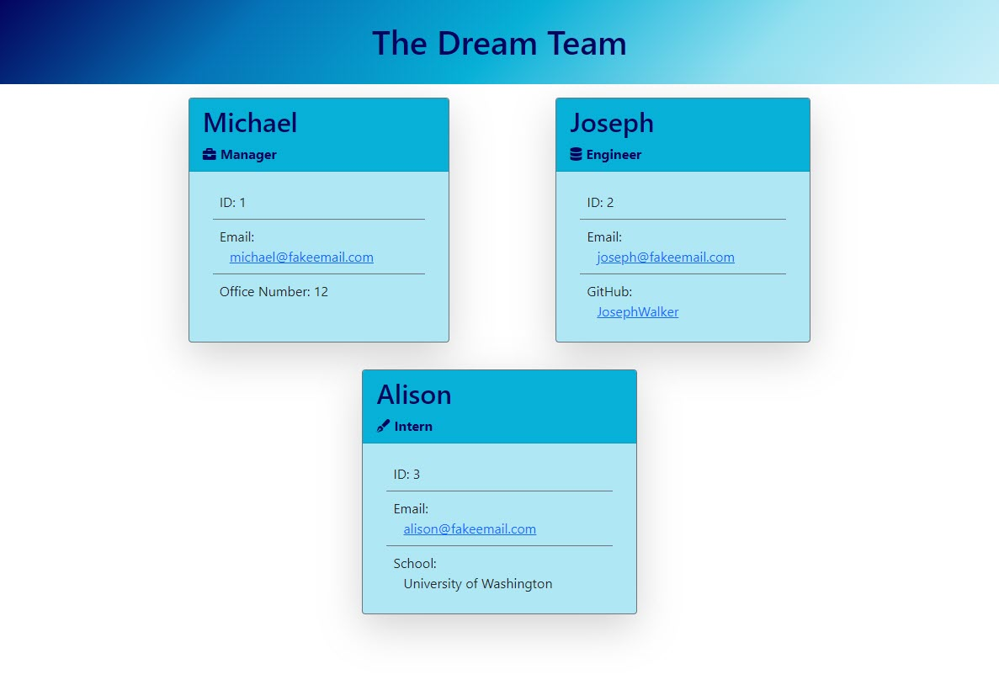

<h1 align="center">Team Profile Builder Using Node.js</h1>
<h2 align="center">Object-Oriented Programming (OOP) and Test-Driven Development (TDD)</h2>

## Description

This Node.js application allows the user to construct a team profile, complete with a manager, engineers and interns. The teamProfile.html file generated as output from this application can be found [here](https://github.com/MichaelHermes/Team-Profile-Builder/blob/main/dist/teamProfile.html).



A complete video walkthrough of this console application can be found [here](https://github.com/MichaelHermes/Team-Profile-Builder/blob/main/src/Demonstration.mp4).

## User Story

```md
AS A manager
I WANT to generate a webpage that displays my team's basic info
SO THAT I have quick access to their emails and GitHub profiles
```

## Acceptance Criteria

```md
GIVEN a command-line application that accepts user input
WHEN I am prompted for my team members and their information
THEN an HTML file is generated that displays a nicely formatted team roster based on user input
WHEN I click on an email address in the HTML
THEN my default email program opens and populates the TO field of the email with the address
WHEN I click on the GitHub username
THEN that GitHub profile opens in a new tab
WHEN I start the application
THEN I am prompted to enter the team manager’s name, employee ID, email address, and office number
WHEN I enter the team manager’s name, employee ID, email address, and office number
THEN I am presented with a menu with the option to add an engineer or an intern or to finish building my team
WHEN I select the engineer option
THEN I am prompted to enter the engineer’s name, ID, email, and GitHub username, and I am taken back to the menu
WHEN I select the intern option
THEN I am prompted to enter the intern’s name, ID, email, and school, and I am taken back to the menu
WHEN I decide to finish building my team
THEN I exit the application, and the HTML is generated
```

## Table of Contents

- [Installation](#installation)
- [Usage](#usage)
- [How to Contribute](#how-to-contribute)
- [Tests](#tests)
- [Questions](#questions)

## Installation

The [Inquirer](https://www.npmjs.com/package/inquirer) package is required in order to execute this application.

`npm init`

`npm i inquirer`

## Usage

`node app`

The user is asked for team details, such as Team Name, Manager, Engineers and Interns, via command-line prompts and upon answering those prompts, an HTML file representing the team profile is generated.

## How to Contribute

[Michael Hermes](https://github.com/MichaelHermes)

## Tests

Testing of this application is performed using [Jest](https://www.npmjs.com/package/jest). A total of five classes are tested: `Employee`, `Manager`, `Engineer`, `Intern`, and `Team`.

`npm i jest -D`

## Questions?

Find me on [Github](https://github.com/MichaelHermes) or email me at [mikehermes87@gmail.com](mailto:mikehermes87@gmail.com).
